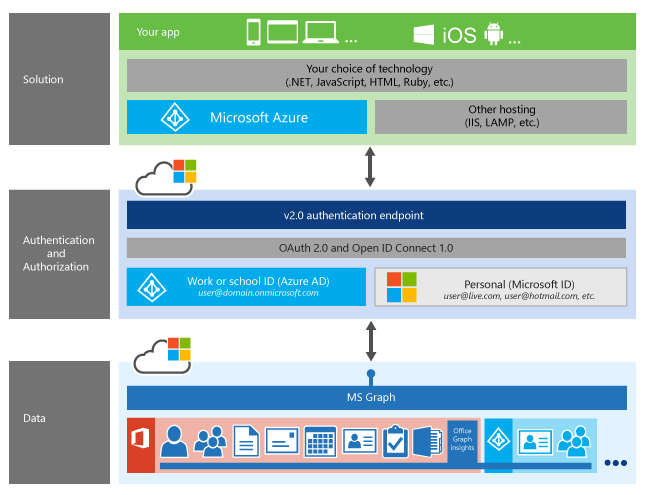

# App authentication with Microsoft Graph

In order to access a user's Microsoft data, your application must enable users to authenticate their identity and give their consent for the app to perform actions on their behalf.

The Microsoft Graph supports two authentication providers:

- To authenticate users with enterprise (that is, work or school) accounts, use Azure Active Directory (Azure AD).
- To authenticate users with personal Microsoft accounts, such as _live.com_ or _outlook.com_ accounts, use the Azure AD v2.0 endpoint.

> **Building apps for enterprise customers?** Your app may not work if your enterprise customer turns on enterprise mobility security features like <a href="https://azure.microsoft.com/en-us/documentation/articles/active-directory-conditional-access-device-policies/" target="_newtab">conditional device access</a>. In this case, you may not know and your customers may experience errors. 

> To support **all enterprise customers** across **all enterprise scenarios**, you must use the Azure AD endpoint and manage your apps using the [Azure Management Portal](https://aka.ms/aadapplist).

## Deciding between the Azure AD and Azure AD v2.0 endpoints

The table below summarizes the major features that the Azure AD and Azure AD v2.0 endpoints support, as well as links to additional information. The relative importance of these various feature--and therefore, which authentication provider you choose to implement in your app--will primarily depend on the account type (enterprise or consumer) it needs to support; the type of app you want to build; and the authentication flow required. 

<table style="width:100%">
  <tr>
    <th></th>
    <th>Azure AD endpoint</th> 
    <th>Azure AD v2.0 endpoint</th>
   </tr>
  <tr>
    <td>Grant types supported</td>
    <td>
Authorization code

Implicit

Client credentials

Resource owner password credentials
</td> 
    <td>
Authorization code

Implicit

Client credentials
</td>
   </tr>
  <tr>
    <td>App types supported</td>
    <td>
Web apps

Web APIs

Mobile and native apps

Single Page App (SPA)

Standalone Web APIs

Daemons/Server Side Apps

<a href="https://azure.microsoft.com/en-us/documentation/articles/active-directory-authentication-scenarios/" target="_newtab">more information</a>
</td> 
    <td>
Web apps

Web APIs

Mobile and native apps

Single Page App (SPA)

Daemons/Server Side Apps

<a href="https://azure.microsoft.com/en-us/documentation/articles/active-directory-v2-flows/" target="_newtab">more information</a></td>
   </tr>
  <tr>
    <td>Conditional access device policies</td>
     <td><a href="https://azure.microsoft.com/en-us/documentation/articles/active-directory-conditional-access-device-policies/" target="_newtab">Supported</a></td> 
    <td>Not currently supported</td>
   </tr>
  <tr>
    <td>OAuth 2.0 and OpenID Connect compliant</td>
    <td>No</td> 
    <td>Yes</td>
  </tr>
  <tr>
    <td>Permissions</td>
    <td>Static: Specified during app registration </td> 
    <td><a href ="https://azure.microsoft.com/en-us/documentation/articles/active-directory-v2-compare/#scopes-not-resources" target="_newtab">Dynamic:</a> Request during app runtime; includes incremental consent</td>
  </tr>
  <tr>
    <td>Account types</td>
    <td> 
work or school
</td> 
    <td>
work or school

personal
 </td>
  </tr>
  <tr>
    <td>App ID </td>
    <td>Separate app ID for each platform</td> 
    <td><a href ="https://azure.microsoft.com/en-us/documentation/articles/active-directory-v2-compare/#one-app-id-for-all-platforms" target="_newtab">Single app ID for multiple platforms</a></td>
  </tr>
  <tr>
    <td>Registration portal </td>
    <td><a href ="https://manage.windowsazure.com/" target="_newtab">Microsoft Azure Management</a></td> 
    <td><a href ="https://apps.dev.microsoft.com" target="_newtab">Microsoft Application Registration</a></td>
  </tr>
  <tr>
    <td>Client libraries </td>
    <td>Active Directory Authentication (ADAL) SDKs for most development platforms</td> 
    <td>
<a href="https://www.nuget.org/packages/Microsoft.Identity.Client" target="_newtab">Microsoft Authentication Library (Preview)</a>

<a href="https://azure.microsoft.com/en-us/documentation/articles/active-directory-v2-limitations/#restrictions-on-libraries-amp-sdks" target="_newtab">Open source OAuth 2.0 libraries (list)</a>
 </td>
  </tr>
  <tr>
    <td>Other features </td>
    <td>
Group claims for Azure AD users

Application Roles and Role Claims
</td> 
    <td></td>
  </tr>
</table> 

In addition, there are differences in permission scopes required by the two authentication providers, as well as differences in the claims returned in various tokens. For more information, see [Well-known scopes](https://azure.microsoft.com/en-us/documentation/articles/active-directory-v2-compare/#well-known-scopes) and [Token Claims](https://azure.microsoft.com/en-us/documentation/articles/active-directory-v2-compare/#token-claims) in [What's different about the v2.0 endpoint?](https://azure.microsoft.com/en-us/documentation/articles/active-directory-v2-compare/).

Also, the Azure AD v2.0 endpoint is under active development, with additional features and supported scenarios being added. For a current list of limitations and restrictions for the Azure AD v2.0 endpoint, see [Should I use the v2.0 endpoint?](https://azure.microsoft.com/en-us/documentation/articles/active-directory-v2-limitations/).

## Registering your app for authentication 

Once you've decided which authentication provider meets your app's requirements, you need to register your app at that authentication provider's portal. Registering your app establishes your app's identity with the authentication provider, and enables your app to specify its identity when submitting authentication requests from the user.

- To [register your app with Azure AD](../auth_azure_ad/app_authentication_azure_ad.md), use the [Microsoft Azure Management portal](https://manage.windowsazure.com/).

	For Azure AD, you'll also need to [associate your Office 365 account with Azure AD subscription](../auth_azure_ad/associate_account.md) in order to manage your apps.

- To [register your app with the Azure AD v2.0 endpoint](../v2/auth_register_app_v2.md), use the [Microsoft Application Registration portal](https://apps.dev.microsoft.com).

## Resources for implementing authentication in your Microsoft Graph app 

Once you've registered your app with the appropriate authentication portal, and have the app registration information (app ID, app secret--if applicable--and redirect URI) that you need to establish your app's identity, you're ready to implement authentication in your app. 

Again, this will vary depending on the type of app you're building, your development platform, the authentication flow you choose, as well as any specific authentication requirements for your app. 

### Connect samples by authentication provider and platform

The table below lists the Connect samples by authentication provider and platform, along with noting whether they connect to Microsoft Graph using REST or a Microsoft Graph client library:

<table>
  <tr>
    <th>Platform</th>
    <th>Azure AD endpoint</th> 
    <th>Azure AD v2.0 endpoint</th>
  </tr>
  <tr>
    <td>Android</td>
    <td>
		<a href="https://github.com/microsoftgraph/android-java-connect-rest-sample">REST sample</a> or 
		<a href="https://github.com/microsoftgraph/android-java-connect-sample/tree/last_v1_auth">SDK sample</a>
	</td> 
    <td>
		<a href="https://github.com/microsoftgraph/android-java-connect-sample">SDK sample</a>
	</td> 
  </tr>
  <tr>
    <td>ASP.NET</td>
    <td>
		<a href="https://github.com/microsoftgraph/aspnet-connect-rest-sample">REST sample</a>
	</td>     
	<td>
		<a href="https://github.com/microsoftgraph/aspnet-connect-sample">SDK sample</a>
	</td> 
  </tr>
  <tr>
    <td>iOS (Obj-C)</td>
    <td>
		<a href="https://github.com/microsoftgraph/ios-objectivec-connect-rest-sample">REST sample</a>
	</td>     
	<td>
		<a href="https://github.com/microsoftgraph/ios-objectivec-connect-sample">SDK sample</a>
	</td> 
  </tr>
  <tr>
    <td>iOS (Swift)</td>
    <td>
		<a href="https://github.com/microsoftgraph/ios-swift-connect-rest-sample">REST sample</a>
	</td>     
	<td>
		<a href="https://github.com/microsoftgraph/ios-swift-connect-sample">SDK sample</a>
	</td> 
  </tr>
  <tr>
    <td>Node.js</td>
    <td>
		<a href="https://github.com/microsoftgraph/nodejs-connect-rest-sample/tree/last_v1_auth">REST sample</a>
	</td>     
	<td>
		<a href="https://github.com/microsoftgraph/nodejs-connect-rest-sample">REST sample</a>
	</td> 
  </tr>
  <tr>
    <td>PHP</td>
    <td>
		<a href="https://github.com/microsoftgraph/php-connect-rest-sample/tree/last_v1_auth">REST sample</a>
	</td>     
	<td>
		<a href="https://github.com/microsoftgraph/php-connect-rest-sample">REST sample</a>
	</td> 
  </tr>
  <tr>
    <td>Python</td>
    <td>
		<a href="https://github.com/microsoftgraph/python3-connect-rest-sample">REST sample</a>
	</td>     
	<td>
	</td> 
  </tr>
  <tr>
    <td>Ruby</td>
    <td>
		<a href="https://github.com/microsoftgraph/ruby-connect-rest-sample/tree/last_v1_auth">REST sample</a>
	</td>     
	<td>
		<a href="https://github.com/microsoftgraph/ruby-connect-rest-sample">REST sample</a>
	</td> 
  </tr>
  <tr>
    <td>UWP</td>
    <td>
		<a href="https://github.com/microsoftgraph/uwp-csharp-connect-rest-sample/tree/last_v1_auth">REST sample</a>
	</td>     
	<td>
		<a href="https://github.com/microsoftgraph/uwp-csharp-connect-rest-sample">REST sample</a> or 
		<a href="https://github.com/microsoftgraph/uwp-csharp-connect-sample">SDK sample</a>
	</td> 
  </tr>
  <tr>
    <td>Xamarin</td>
    <td>
	</td>     
	<td>
		<a href="https://github.com/microsoftgraph/xamarin-csharp-connect-sample">SDK sample</a>
	</td> 
  </tr>
</table>

To explore a wide range of projects that connect to Microsoft Graph over a broad assortment of technologies, visit the [Microsoft Graph repo](https://github.com/microsoftgraph) on GitHub. 

### Getting Started  

In addition, the [Getting Started](http://graph.microsoft.io/en-us/docs/platform/rest#getting-started-with-the-microsoft-graph-api-and-rest) section contains detailed articles on how to create the above samples using the Azure AD v2.0 endpoint, including discussion of the authentication libraries used on each platform. 

## See also

Azure AD endpoint:

- <a href="https://azure.microsoft.com/en-us/documentation/articles/active-directory-authentication-scenarios/#basics-of-authentication-in-azure-ad" target="_newtab">Authentication Scenarios for Azure AD</a>

Azure AD v2.0 endpoint:

- <a href="https://azure.microsoft.com/en-us/documentation/articles/?product=active-directory&term=v2.0+endpoint" target="_newtab">Azure AD v2.0 endpoint documentation on Azure.com</a>
- <a href="https://azure.microsoft.com/en-us/documentation/articles/active-directory-v2-app-registration/#build-a-quick-start-app" target="_newtab">Azure AD v2.0 code quick starts on Azure.com</a>
